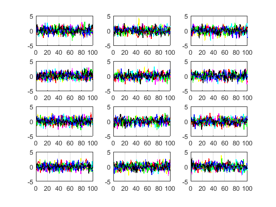
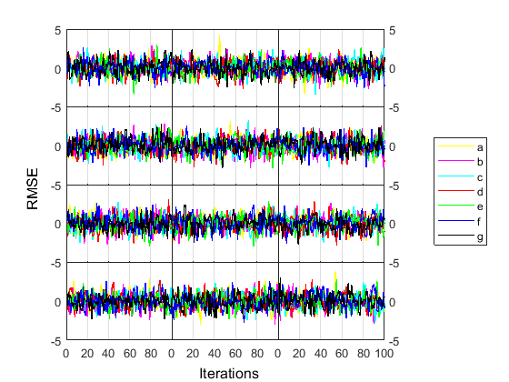

# stackplots
Stack Matlab subplots in mxn format with overlapping axes.

## Example
Turns this 

 

into this 

.

## Usage
### INPUTS:
- fig -- figure with mxn subplots
- m -- number of rows
- n -- number of columns

### PARAMETERS:
- xlabel -- global x axis label
- ylabel -- global y axis label

Sample call

    stackplots(gcf,m,n);
    
to be used on a figure containing mxn subplots.

Have a look at the [test script](test_stackplots.m) for a full example.
